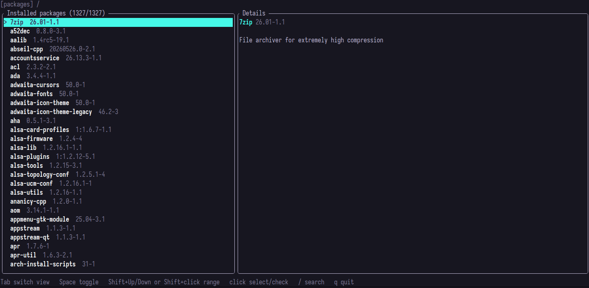
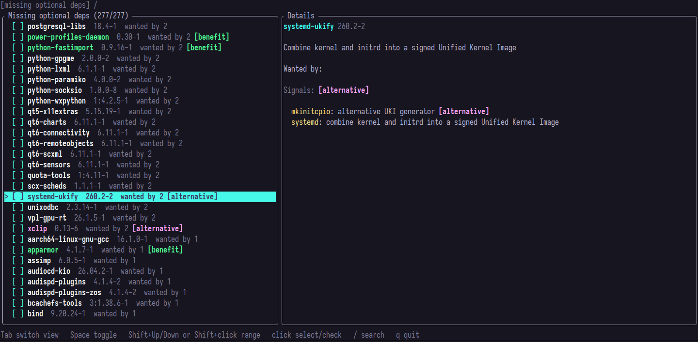

# pacopt

pacopt is a small terminal tool for reviewing missing optional dependencies on pacman-based systems.

It shows installed packages, their optional dependencies, and a list of optional dependencies that are not installed.

## Screenshots

Package view:



Missing optional dependencies view:



## Requirements

- Arch Linux or another pacman-based system
- Rust toolchain

## Run

```sh
cargo run
```

When you quit, selected missing optional dependency names are printed to stdout.

## UI preview

The text snapshots used by UI tests are in `tests/fixtures/ui/`.

Print the same rendered preview with:

```sh
cargo test preview_tested_ui -- --ignored --nocapture
```

Update the snapshots with:

```sh
cargo run --example update_ui_preview_snapshot
```

## Controls

- `Tab`: switch view
- `Up` / `Down` or `k` / `j`: move selection
- `Space`: toggle a missing optional dependency
- `Shift+Up` / `Shift+Down`: select a range
- Click a checkbox: toggle it
- Drag from a checkbox: toggle multiple entries
- `/`: search
- `Esc` or `q`: quit
